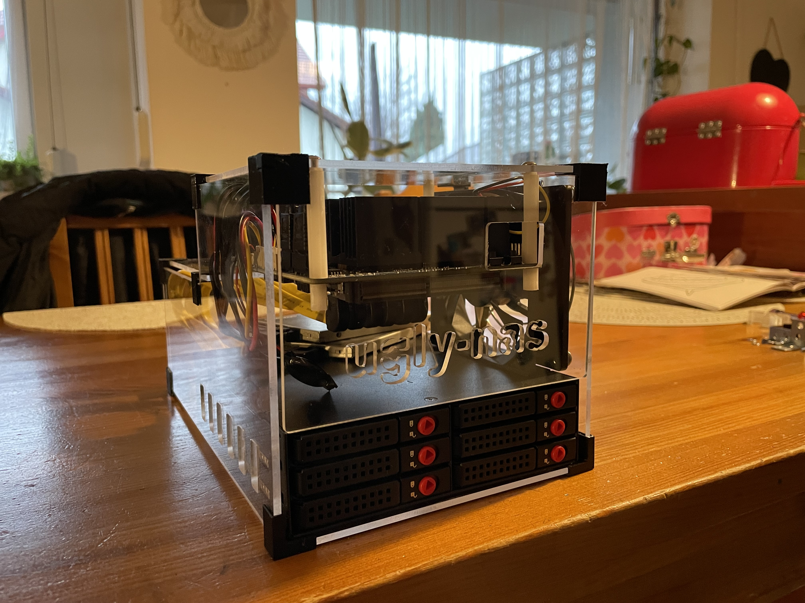
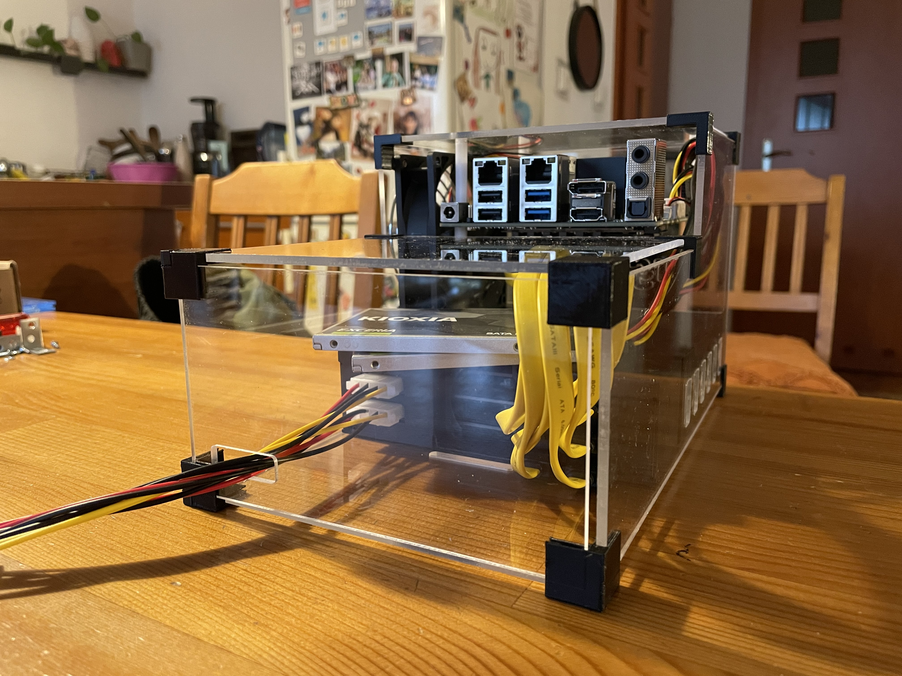
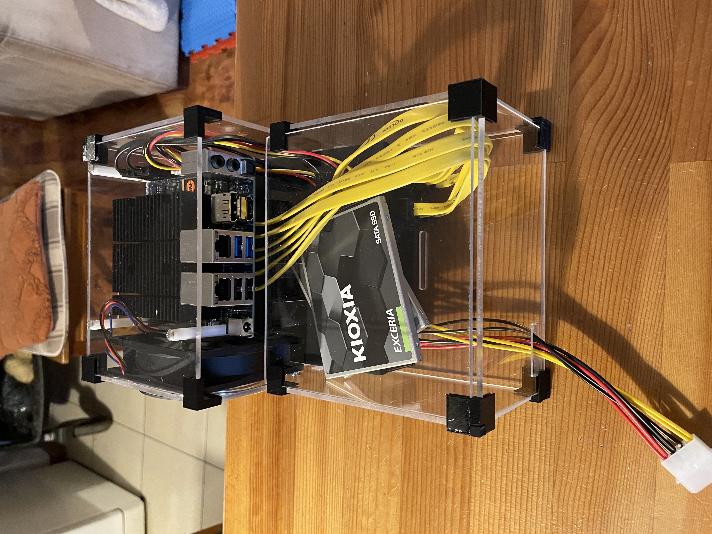
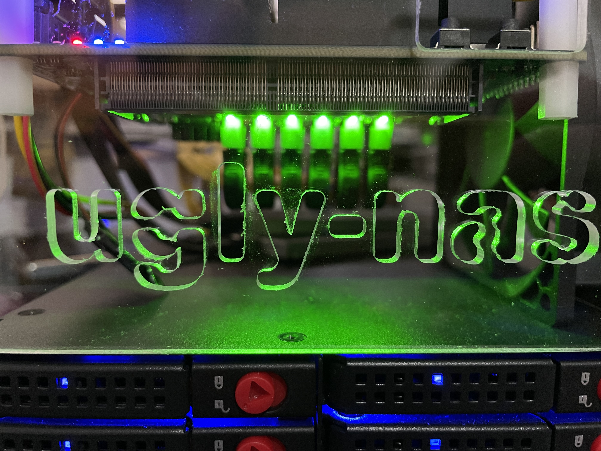
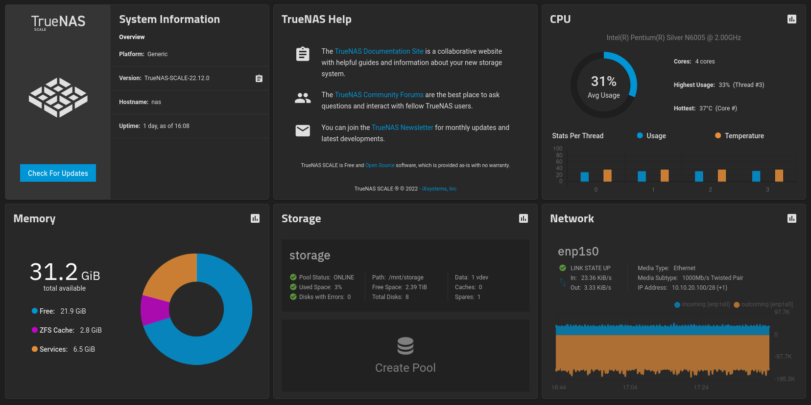

## DIY 8-disks NAS based on Odroid H3+ under $1k with disks

### Why is it ugly?

Well to be honest it's not so ugly anymore. 

But early case versions were really [ugly](/ugly) and when I eventually created decently looking case I decided to leave its name.

### So how does it look now?

### Cost (November 2022):

| Part  | USD  |
|-------|--------:|
| [Odroid H3+](https://www.hardkernel.com/shop/odroid-h3-plus/) | 165.00 |
| [64GB eMMC Module](https://www.hardkernel.com/shop/64gb-emmc-module-h2/) | 39.90 |
| [Samsung 32GB DDR4](https://www.hardkernel.com/shop/samsung-32gb-ddr4-pc4-25600-so-dimm/) | 107.00 |
| [Case Type 5](https://www.hardkernel.com/shop/odroid-h3-case-type-5/) | 20.00 |
| [Power Supply Unit](https://www.hardkernel.com/shop/15v-4a-power-supply-asia-korea-plug-copy/) | 9.40 |
| 2 x [SATA/Power cables for disks](https://www.hardkernel.com/shop/sata-data-and-power-cable/) | 6.00 |
| Shipping from hardkernel.com to Poland | 39.43 |
| 8 x [Kioxia 2.5" SSD 480GB drives](https://www.ebay.com/itm/134327464843) | ~350.00 |
| [6-bays enclosure](https://aliexpress.com/item/32921898033.html) | 48.29 |
| [Additional PSU for enclosure](https://aliexpress.com/item/4000253348414.html) | 5.91 |
| [PCI-E SATA extender for 6 ports](https://aliexpress.com/item/1005004374186238.html) | 24.80 |
| 6 x [Profiled SATA cables](https://pl.aliexpress.com/item/1005002384391035.html) | 16.74 |
| [MOLEX splitter](https://aliexpress.com/item/1005004236892928.html) | 1.71 |
| **Sum** | **834.18** | 

Beware that I spent more than that... but I was trying various solutions. Above is an effect of my work ;)

I'm also still trying to implement some changes. I'm on my way to remove requirenment for additional PSU.
This means that some parts from this list will disappear but some splitters/connectors will show up instead.
Also you don't really need case from Odroid if you want to use self crafted  but that means you have to buy fan and some screws yourself.
Will document everything once I'm sure what exactly is needed.

### Performance

    root@nas[/mnt/storage]# /root/fio --randrepeat=1 --ioengine=libaio --direct=1 --gtod_reduce=1 --name=test --filename=test.fio --bs=4k --iodepth=64 --size=1G --readwrite=randrw --rwmixread=80
    test: (g=0): rw=randrw, bs=(R) 4096B-4096B, (W) 4096B-4096B, (T) 4096B-4096B, ioengine=libaio, iodepth=64
    fio-3.25
    Starting 1 process
    test: Laying out IO file (1 file / 1024MiB)
    Jobs: 1 (f=1): [m(1)][100.0%][r=134MiB/s,w=33.0MiB/s][r=34.3k,w=8701 IOPS][eta 00m:00s]
    test: (groupid=0, jobs=1): err= 0: pid=691249: Mon Dec  5 18:10:27 2022
      read: IOPS=22.9k, BW=89.6MiB/s (93.9MB/s)(819MiB/9142msec)
       bw (  KiB/s): min=21781, max=165208, per=99.06%, avg=90861.61, stdev=42994.49, samples=18
       iops        : min= 5445, max=41302, avg=22715.33, stdev=10748.69, samples=18
      write: IOPS=5744, BW=22.4MiB/s (23.5MB/s)(205MiB/9142msec); 0 zone resets
       bw (  KiB/s): min= 5343, max=41728, per=99.04%, avg=22756.61, stdev=10894.22, samples=18
       iops        : min= 1335, max=10432, avg=5689.06, stdev=2723.60, samples=18
      cpu          : usr=5.09%, sys=78.22%, ctx=5155, majf=4, minf=7
      IO depths    : 1=0.1%, 2=0.1%, 4=0.1%, 8=0.1%, 16=0.1%, 32=0.1%, >=64=100.0%
         submit    : 0=0.0%, 4=100.0%, 8=0.0%, 16=0.0%, 32=0.0%, 64=0.0%, >=64=0.0%
         complete  : 0=0.0%, 4=100.0%, 8=0.0%, 16=0.0%, 32=0.0%, 64=0.1%, >=64=0.0%
         issued rwts: total=209630,52514,0,0 short=0,0,0,0 dropped=0,0,0,0
         latency   : target=0, window=0, percentile=100.00%, depth=64

    Run status group 0 (all jobs):
       READ: bw=89.6MiB/s (93.9MB/s), 89.6MiB/s-89.6MiB/s (93.9MB/s-93.9MB/s), io=819MiB (859MB), run=9142-9142msec
      WRITE: bw=22.4MiB/s (23.5MB/s), 22.4MiB/s-22.4MiB/s (23.5MB/s-23.5MB/s), io=205MiB (215MB), run=9142-9142msec

And same test with 10M file instead of 1G:

    root@nas[/mnt/storage]# /root/fio --randrepeat=1 --ioengine=libaio --direct=1 --gtod_reduce=1 --name=test --filename=test.fio --bs=4k --iodepth=64 --size=10M --readwrite=randrw --rwmixread=80
    test: (g=0): rw=randrw, bs=(R) 4096B-4096B, (W) 4096B-4096B, (T) 4096B-4096B, ioengine=libaio, iodepth=64
    fio-3.25
    Starting 1 process

    test: (groupid=0, jobs=1): err= 0: pid=695373: Mon Dec  5 18:25:17 2022
      read: IOPS=97.1k, BW=379MiB/s (398MB/s)(8156KiB/21msec)
      write: IOPS=24.8k, BW=96.9MiB/s (102MB/s)(2084KiB/21msec); 0 zone resets
      cpu          : usr=0.00%, sys=90.00%, ctx=0, majf=0, minf=7
      IO depths    : 1=0.1%, 2=0.1%, 4=0.2%, 8=0.3%, 16=0.6%, 32=1.2%, >=64=97.5%
         submit    : 0=0.0%, 4=100.0%, 8=0.0%, 16=0.0%, 32=0.0%, 64=0.0%, >=64=0.0%
         complete  : 0=0.0%, 4=100.0%, 8=0.0%, 16=0.0%, 32=0.0%, 64=0.1%, >=64=0.0%
         issued rwts: total=2039,521,0,0 short=0,0,0,0 dropped=0,0,0,0
         latency   : target=0, window=0, percentile=100.00%, depth=64

    Run status group 0 (all jobs):
       READ: bw=379MiB/s (398MB/s), 379MiB/s-379MiB/s (398MB/s-398MB/s), io=8156KiB (8352kB), run=21-21msec
      WRITE: bw=96.9MiB/s (102MB/s), 96.9MiB/s-96.9MiB/s (102MB/s-102MB/s), io=2084KiB (2134kB), run=21-21msec

With iozone:

    root@nas[/mnt/storage]# /root/iozone -e -I -a -s 1G -r 4k -r 16k -r 512k -r 1024k -r 16384k -i 0 -i 1 -i 2     
            Iozone: Performance Test of File I/O
                    Version $Revision: 3.489 $
                    Compiled for 64 bit mode.
                    Build: linux-AMD64 
    
            Contributors:William Norcott, Don Capps, Isom Crawford, Kirby Collins
                         Al Slater, Scott Rhine, Mike Wisner, Ken Goss
                         Steve Landherr, Brad Smith, Mark Kelly, Dr. Alain CYR,
                         Randy Dunlap, Mark Montague, Dan Million, Gavin Brebner,
                         Jean-Marc Zucconi, Jeff Blomberg, Benny Halevy, Dave Boone,
                         Erik Habbinga, Kris Strecker, Walter Wong, Joshua Root,
                         Fabrice Bacchella, Zhenghua Xue, Qin Li, Darren Sawyer,
                         Vangel Bojaxhi, Ben England, Vikentsi Lapa,
                         Alexey Skidanov, Sudhir Kumar.
    
            Run began: Mon Jan 16 16:52:27 2023
    
            Include fsync in write timing
            O_DIRECT feature enabled
            Auto Mode
            File size set to 1048576 kB
            Record Size 4 kB
            Record Size 16 kB
            Record Size 512 kB
            Record Size 1024 kB
            Record Size 16384 kB
            Command line used: /root/iozone -e -I -a -s 1G -r 4k -r 16k -r 512k -r 1024k -r 16384k -i 0 -i 1 -i 2
            Output is in kBytes/sec
            Time Resolution = 0.000001 seconds.
            Processor cache size set to 1024 kBytes.
            Processor cache line size set to 32 bytes.
            File stride size set to 17 * record size.
                                                                  random    random     bkwd    record    stride                                    
                  kB  reclen    write  rewrite    read    reread    read     write     read   rewrite      read   fwrite frewrite    fread  freread
             1048576       4   310964   292306  1178512  1179537   173968   195313                                                                
             1048576      16   293274   307902  2134753  2159181   626843   278066                                                                
             1048576     512  1010432  1793142  6357664  2866019  3240346   999201                                                                
             1048576    1024   798928  1539648  4325665  4094047  6342773  1731892                                                                
             1048576   16384   809463  1588195  4512099  2468875  2813374  1110396                                                                
    
    iozone test complete.

Feel free to ping me if you want me to run any other tests.

### Power consumption in Watts

| State | Peak | Avg |
|-------|-------:|-------:|
| standby | - | 3.6 |
| boot | 24.2 | ~17 |
| idling | 17.7 | ~14 |
| 1 VM running | 22.3 | ~16 |
| VM + stress CPU + fio test | 30.8 | ~28 |

Note: Don't try to use HDD instead of SDD with my power supply setup... it won't work almost for sure.

After running some power usage tests it seems that additional case shouldn't require external PSU and should be able to use power from Odroid.
I've just ordered some splitters/connectors and next week will try to get rid of extra PSU.

### Does it support ECC?

No. It can't.

### What software does it run?

It runs TrueNAS Scale.

### Can it be any cheaper?

Yup.

Without disks it's below $500 ;)

Also it should still work pretty decent if you switch:
  * H3+ -> H3 - 36$ less
  * eMMC 64GB -> 32GB - $13 less
  * RAM 32GB -> 16GB - $54 less

So without disks it can be built for about $370.

### Why are two disks directly plugged into Odroid not part of enclosure?

Odroid [doesn't](https://wiki.odroid.com/odroid-h3/hardware) support hotplug for devices directly attached to it so it doesn't really make sense to make them part of enclosure.

### How to get that lovely case?

All needed parts are listed [there](/case).
