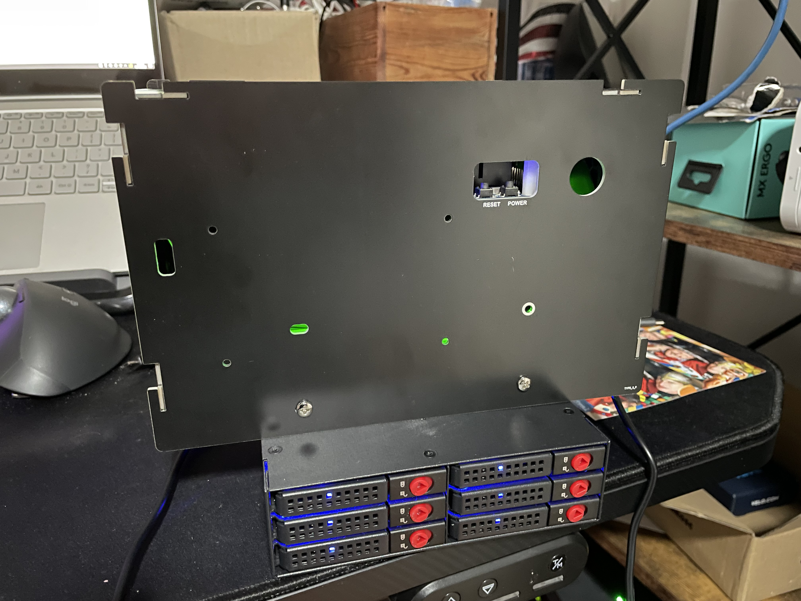
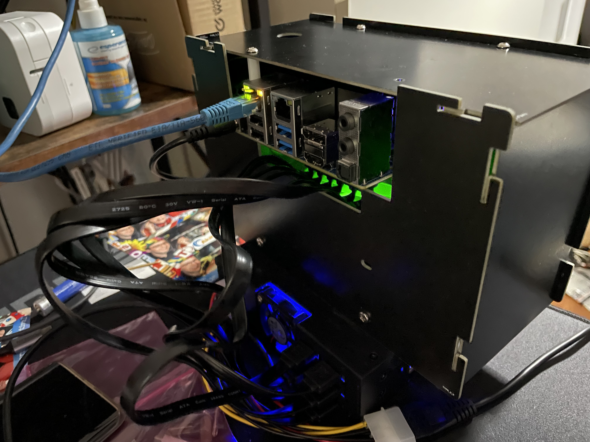

DIY 8-disks NAS based on Odroid H3+ under $1k with disks

# Why is it ugly?
Cause I didn't have time / skills to create case for it.
And yes it looks ugly as of now.

# Cost (November 2022):
 * Odroid H3+ - $165
 * 64GB eMMC Module - $39.90
 * Samsung 32GB DDR4 - $107
 * Case Type 5 - $20
 * EU Plug - $9.40
 * SATA/Power cables for disks - $6
 * Shipping from hardkernel.com to Poland - $39.43
 * 8 x Kioxia 2.5" SSD 480GB drives - $350
 * Thermaltake 6-bays case - $50
 * additional PSU for case - $10
 * MOLEX splitter - $2
 * PCI-E SATA extender for 6 ports - $24.80

Sum: $823.53

# Does it work?
Hell yeah!

# Can it be any cheaper?
Yup.

Without disks it's below $500 ;)

Also it should still work pretty decent if you switch:
  * H3+ -> H3 - 36$ less
  * eMMC 64GB -> 32GB - $13 less
  * RAM 32GB -> 16GB - $54 less

So without disks it can be built for about $370.

# Software

It runs TrueNAS Scale

# Ignore for now... still learning markdown :P
| Part  | pcs  | price  | sum  |
|-------|------|--------|------|
| [Odroid H3+](https://www.hardkernel.com/shop/odroid-h3-plus/) | 1 | 165 | 165 |
